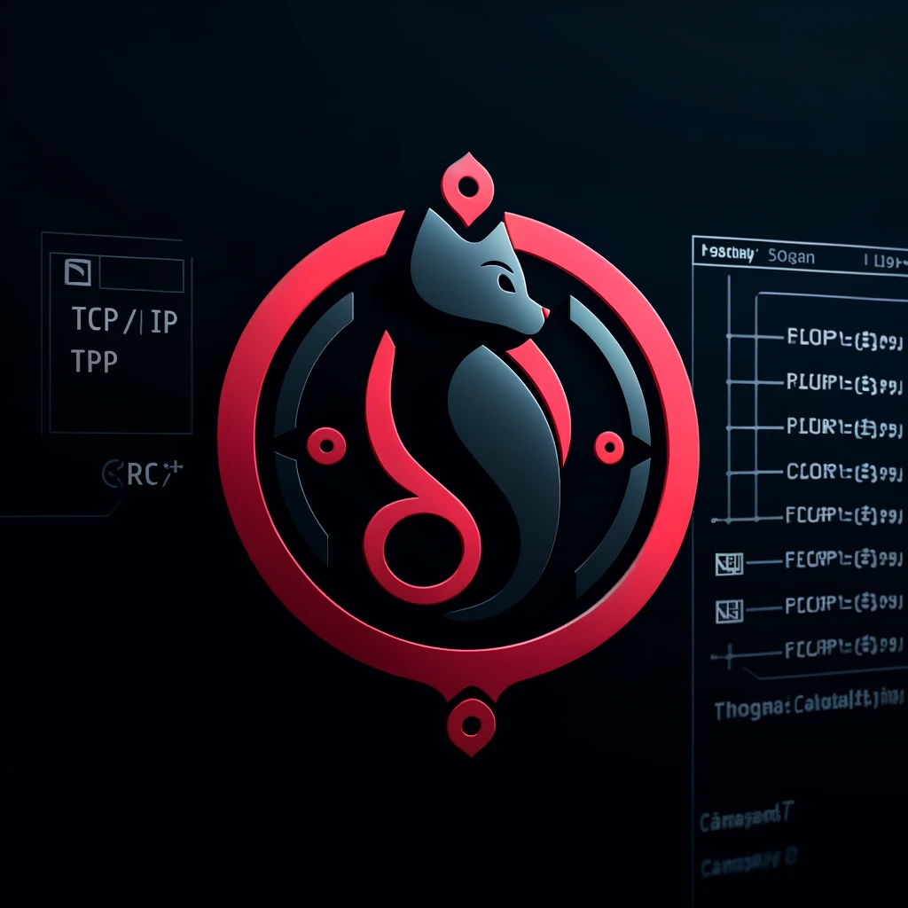

<h1 align="center">
⛧ Calypso ⛧
</h1>



# Resume
Calypso is a terminal program built in Ruby using TCP for communication and following the MVC (Model-View-Controller) design pattern. This pogram allows users to create or join chat rooms, with the option to set a password for security.

# Utilisation
```sh
git clone https://github.com/DALM1/Calypso.git
```

```sh
cd Calypso
```

```sh
bundle install
```
```sh
ruby cli.rb
```
